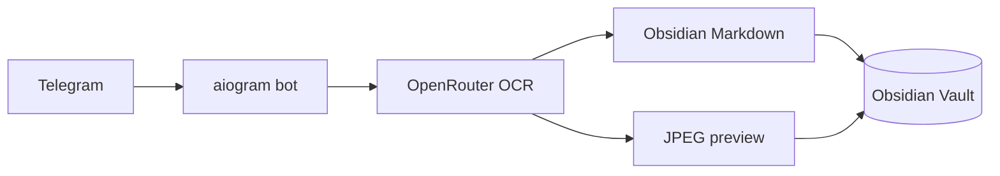

# img2prompt

  

Telegram-бот распознаёт текст на фото и сохраняет Markdown-заметки с JPEG-превью для Obsidian. В Telegram он отвечает только текстом: без эхо, копирования и пересылки медиа.

## Структура

```text
.
├── Dockerfile                         # Образ бота для GitHub/GHCR-поставки
├── docker-compose.yml                 # Серверный запуск из APP_PATH
├── gh_docker-compose.yml              # Запуск готового образа из GHCR
├── .github/workflows/ci-ghcr.yml      # PR-проверки и публикация образа main
├── bot.py                             # Хендлеры, OCR и сохранение заметок
├── preview_assets.py                  # JPEG-превью и MD5-дедупликация
├── requirements.txt
└── tests/
```

## Возможности

- OCR фото, документов-изображений и альбомов через OpenRouter.
- Obsidian Markdown, EXIF-коррекция, прозрачные PNG и JPEG-превью до 300 px.
- Ответы Telegram только текстом; регрессионный тест запрещает исходящие медиа, copy и forward.

## Архитектура



## Два варианта Docker Compose

### `docker-compose.yml` — запуск из серверной папки

Этот вариант сохраняет исходную схему: `${APP_PATH}` монтируется в `/app`, а контейнер запускает код из папки проекта на сервере. Используйте его для существующего локального Stack или ручной разработки на сервере.

После изменения кода в `APP_PATH` нужен restart/redeploy контейнера. Push в GitHub сам по себе этот код не заменяет.

### `gh_docker-compose.yml` — запуск кода из GitHub

Этот вариант **не монтирует `${APP_PATH}`**. GitHub Actions собирает `Dockerfile`, публикует образ в GHCR, а Portainer запускает `${BOT_IMAGE}:${IMAGE_TAG}`. На сервере остаются только постоянные Obsidian-данные и Docker socket.

Для GitHub-Stack укажите Compose path `gh_docker-compose.yml`, reference `refs/heads/main` и переменные из `.env.example`. Для публичного GHCR-образа authentication не нужна; для приватного настройте registry credentials в Portainer.

## GitOps: merge в main → автоматическое обновление

1. Создайте ветку `agent/<задача>`, внесите изменения и откройте draft PR.
2. Workflow запускает тесты для PR, но не публикует и не разворачивает ветку.
3. После merge в `main` workflow повторяет проверки, публикует теги `main` и `sha-<commit>` в GHCR.
4. Workflow вызывает Portainer webhook только если в GitHub Secrets задан `PORTAINER_WEBHOOK_URL`.
5. Portainer подтягивает новый образ и перезапускает единственный bot-контейнер.

В Portainer для GitHub Stack включите GitOps updates → **Webhook**, затем **Re-pull image** и **Force redeployment**. Добавьте выданный webhook URL в GitHub Actions Secret `PORTAINER_WEBHOOK_URL`; не коммитьте его в репозиторий.

Для первого перехода сначала дождитесь успешной публикации GHCR-образа, затем вручную разверните GitHub Stack. После подтверждения работы включайте webhook. Перед заменой остановите старый Stack: два экземпляра с одним `BOT_TOKEN` конфликтуют при polling, а одинаковый `CONTAINER_NAME` конфликтует в Docker.

Откат: в Portainer временно установите `IMAGE_TAG=sha-<предыдущий-commit>` и сделайте redeploy. SHA-теги остаются привязанными к конкретным проверенным commit.

## Конфигурация

Скопируйте `.env.example` в приватный `.env` для локального запуска или перенесите значения в Portainer Environment Variables. Никогда не добавляйте `.env` в Git.

| Переменная | Назначение |
| --- | --- |
| `BOT_TOKEN`, `PAID_KEY`, `ADMIN_ID` | Доступ Telegram, OpenRouter и администратора |
| `APP_PATH` | Только для `docker-compose.yml` с серверным исходным кодом |
| `BOT_IMAGE`, `IMAGE_TAG` | Только для `gh_docker-compose.yml` и GHCR |
| `SAVE_PATH`, `ATTACHMENTS_PATH` | Постоянные данные Obsidian |
| `HTTP_PROXY`, `HTTPS_PROXY` | Необязательный proxy |
| `CONTAINER_NAME`, `DOCKER_SOCKET_PATH` | Контейнер и Docker socket |
| `APPLICATION_NETWORK`, `PROXY_NETWORK` | Существующие внешние Docker networks |

## Проверка

```bash
python -B -m unittest discover -v -s tests
docker compose --env-file .env.example -f docker-compose.yml config
docker compose --env-file .env.example -f gh_docker-compose.yml config
```


<details>
<summary>Previous README versions</summary>

Публичных предыдущих версий пока нет.

</details>

<p align="right">Created by oxotn1k</p>

## Ручное переключение шлюза

Администратор может нажать 🔄 Переключить шлюз. Бот проверяет Telegram и OpenRouter через следующий шлюз, затем переключает оба клиента. Задайте PRIMARY_PROXY_URL и RESERVE_PROXY_URL только в Portainer или локальном игнорируемом .env; адреса и учётные данные не публикуются.
