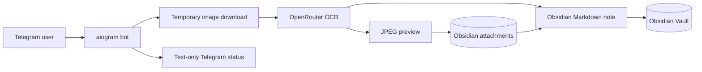

# img2prompt

   

Telegram-бот превращает фотографии, документы с изображениями и альбомы в структурированные Markdown-заметки для Obsidian. OCR выполняется через OpenRouter, а пользователю в Telegram возвращаются только текстовые статусы — без эхо, пересылки и копирования медиа.

<details>
<summary>📁 Project structure 🟢⬇️⬇️⬇️</summary>

```text
.
├── .env.example                    # Безопасный шаблон локальной конфигурации
├── assets/
│   └── readme-hero.png             # Иллюстрация README
├── docs/
│   └── architecture/
│       └── project-graph.mmd       # Канонический Mermaid-граф
├── bot.py                           # Хендлеры, OCR-конвейер и сохранение заметок
├── docker-compose.yml               # Параметризованный Docker/Portainer Stack
├── preview_assets.py                # JPEG-превью и MD5-дедупликация
├── requirements.txt                 # Зависимости Python
└── tests/
    ├── test_preview_assets.py       # Превью, прозрачность, MD5 и Obsidian-ссылки
    ├── test_preview_exif.py         # EXIF-ориентация
    └── test_source_contract.py      # Public-config и text-only контракт
```

</details>

## Обзор

Проект создан для быстрого конвейера «изображение → понятная заметка». Бот собирает альбомы в исходном порядке, извлекает текст мультимодальной моделью, создаёт Markdown-файл и сохраняет локальное JPEG-превью рядом с заметками Obsidian.

## Возможности

- Принимает одиночные фотографии, изображения-документы и альбомы.
- Формирует Obsidian Markdown с заголовками, тегами, wiki-ссылками и блоками извлечённого текста.
- Сохраняет пропорциональные JPEG-превью шириной до 300 px; одинаковые изображения используют один MD5-файл.
- Обрабатывает EXIF-ориентацию и прозрачные PNG без обрезки.
- Использует fallback-модель при ошибке основной OCR-модели.
- Отправляет в Telegram только текстовые сообщения; тест запрещает outbound media-, copy- и forward-вызовы.

## Архитектура



[Открыть исходник графа](docs/architecture/project-graph.mmd)

## Технологический стек

| Область | Используется |
| --- | --- |
| Рантайм | Python 3.11+ |
| Telegram | aiogram |
| OCR | OpenRouter через `openai` SDK |
| Модели | `google/gemini-2.5-flash` с fallback `openai/gpt-4o-mini` |
| Изображения | Pillow |
| Сеть | `httpx`, `aiohttp-socks`, опциональный HTTP(S)-proxy |
| Хранение | Obsidian Markdown и папка attachments |
| Деплой | Docker Compose / Portainer |

## Запуск

### Локально

Создайте приватный `.env` из шаблона и заполните все переменные.

```bash
cp .env.example .env
python -m venv .venv
. .venv/bin/activate
pip install -r requirements.txt
python bot.py
```

В Windows активируйте окружение командой `.venv\Scripts\Activate.ps1`.

### Docker / Portainer

`docker-compose.yml` не содержит персональных путей, токенов или сетевых имён: все они берутся из локального `.env` либо из Environment Variables Stack в Portainer.

```bash
docker compose --env-file .env config
docker compose --env-file .env up -d
docker compose logs -f vision_bot
```

Перед запуском должны существовать два внешних Docker network, указанных в `APPLICATION_NETWORK` и `PROXY_NETWORK`.

## Конфигурация

Скопируйте `.env.example` в `.env`. Файл `.env` игнорируется Git и никогда не должен публиковаться.

| Переменная | Назначение |
| --- | --- |
| `BOT_TOKEN` | Токен, полученный у BotFather |
| `PAID_KEY` | API-ключ OpenRouter |
| `ADMIN_ID` | Числовой Telegram ID единственного администратора |
| `APP_PATH` | Путь хоста к папке проекта, монтируемой в `/app` |
| `SAVE_PATH` | Путь хоста и контейнера к папке Markdown-заметок |
| `ATTACHMENTS_PATH` | Путь хоста и контейнера к папке JPEG-вложений |
| `HTTP_PROXY`, `HTTPS_PROXY` | Необязательный proxy для Telegram и OpenRouter |
| `APPLICATION_NETWORK`, `PROXY_NETWORK` | Имена существующих внешних Docker-сетей |
| `CONTAINER_NAME`, `DOCKER_SOCKET_PATH` | Настройки контейнера и Docker socket |

Для Linux/NAS пути можно задавать по шаблону `/srv/dev-disk-by-uuid-<disk-uuid>/...`; точные значения зависят от конкретного хоста.

## Проверка

```bash
python -B -m unittest discover -v
python -B -c "import ast, pathlib; [ast.parse(path.read_text(encoding='utf-8-sig')) for path in [pathlib.Path('bot.py'), pathlib.Path('preview_assets.py')]]"
docker compose --env-file .env.example config
```

Тесты проверяют создание превью, EXIF, MD5-дедупликацию, Obsidian-разметку, text-only ответы и отсутствие личных путей/ID в публичном коде.

## Превью


<details>
<summary>🕘 Previous README versions 🟢⬇️⬇️⬇️</summary>

Публичных предыдущих версий пока нет: репозиторий публикуется впервые.

</details>

<p align="right">Created by oxotn1k</p>
