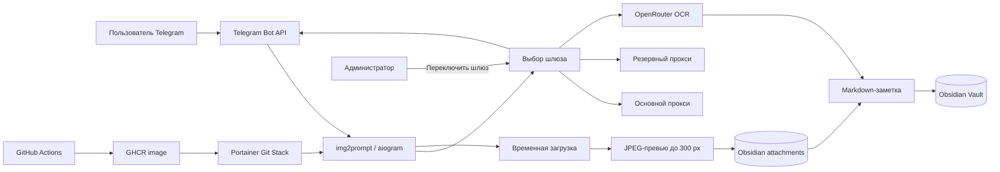

# img2prompt

  

Личный Telegram-бот для OCR изображений через OpenRouter. Он сохраняет Obsidian-совместимые Markdown-заметки и компактные JPEG-превью, а в Telegram отвечает исключительно текстом: без эхо, copy, forward и исходящих медиафайлов.

## Возможности

- OCR фото, документов-изображений и альбомов через OpenRouter.
- Markdown-заметки для Obsidian, EXIF-коррекция, белый фон для прозрачных PNG и JPEG-превью шириной до 300 px.
- Дедупликация физических вложений по MD5.
- Сохранение порядка: превью и транскрипция каждого изображения идут рядом.
- Регрессионный тест запрещает исходящие медиа, copy и forward.

## Архитектура



Подробная схема без адресов и секретов: [docs/architecture/project-graph.mmd](docs/architecture/project-graph.mmd).

## Структура

```text
.
├── Dockerfile                         # Образ для GitHub/GHCR-поставки
├── docker-compose.yml                 # Серверный запуск из APP_PATH
├── gh_docker-compose.yml              # Запуск готового образа из GHCR
├── .github/workflows/ci-ghcr.yml      # PR-проверки и публикация образа main
├── bot.py                             # Хендлеры, OCR, Markdown и UI администратора
├── preview_assets.py                  # JPEG-превью и MD5-дедупликация
├── proxy_routing.py                   # Резервное проксирование
├── docs/architecture/project-graph.mmd
├── .env.example                       # Безопасный шаблон переменных
└── tests/                             # Регрессионные проверки
```

## Ручное переключение шлюза и резервный прокси

| Переменная | Роль |
| --- | --- |
| `PRIMARY_PROXY_URL` | Основной прокси для Telegram и OpenRouter |
| `RESERVE_PROXY_URL` | Резервный прокси |
| `HTTP_PROXY` | Совместимый fallback, если основной URL не задан |

Кнопка администратора **🔄 Переключить шлюз** проверяет Telegram и OpenRouter через следующий шлюз. Лишь после успешной проверки бот переключает оба клиента и сохраняет активный выбор в папке заметок. Адреса и учётные данные прокси указываются только в Portainer или локальном игнорируемом `.env`.

## Два варианта Docker Compose

### `docker-compose.yml` — серверная папка

Контейнер получает код через bind mount `${APP_PATH}:/app`. Это вариант для существующего серверного Stack и ручной отладки: изменение файлов в `APP_PATH` требует restart/redeploy, а GitHub push сам код на сервер не заменяет.

### `gh_docker-compose.yml` — образ из GitHub

Этот Compose не монтирует `APP_PATH`. После merge в `main` GitHub Actions собирает `Dockerfile` и публикует образ `${BOT_IMAGE}:${IMAGE_TAG}` в GHCR. Portainer запускает этот образ, сохраняя постоянные Obsidian-данные и Docker socket на сервере.

Для GitHub Stack используйте:

- Repository reference: `refs/heads/main`
- Compose path: `gh_docker-compose.yml`
- Переменные окружения: из локального `.env` или Portainer Environment Variables
- Git authentication: выключена для public-репозитория; для private используйте отдельный read-only fine-grained PAT

## Проверенный процесс обновления

1. Создайте ветку `agent/<задача>`.
2. Внесите изменения, запустите тесты и откройте draft PR.
3. После зелёных checks выполните merge в `main`.
4. Дождитесь зелёного workflow **CI and GHCR publish** для `main`: он публикует новый GHCR-образ.
5. В Portainer выберите Git Stack и выполните **Pull and redeploy**.

Webhook в GitOps можно оставить включённым как интеграционную точку. Без доступных функций **Re-pull image** и **Force redeployment** он не является гарантией обновления mutable-тега образа, поэтому рабочий стандарт проекта — ручной redeploy после зелёного GitHub Actions.

Перед первым переходом остановите старый Stack: два экземпляра с одинаковыми токеном или именем контейнера конфликтуют при polling.

## Конфигурация

Скопируйте `.env.example` в приватный `.env` для локального запуска или задайте те же значения в Portainer. Реальный `.env` никогда не добавляйте в Git.

| Переменная | Назначение |
| --- | --- |
| `BOT_TOKEN`, `PAID_KEY`, `ADMIN_ID` | Telegram, OpenRouter и доступ администратора |
| `APP_PATH` | Только для серверного `docker-compose.yml` |
| `BOT_IMAGE`, `IMAGE_TAG` | Только для `gh_docker-compose.yml` |
| `SAVE_PATH`, `ATTACHMENTS_PATH` | Markdown-заметки и JPEG-вложения Obsidian |
| `PRIMARY_PROXY_URL`, `RESERVE_PROXY_URL`, `HTTP_PROXY`, `HTTPS_PROXY` | Исходящие прокси |
| `CONTAINER_NAME`, `DOCKER_SOCKET_PATH` | Контейнер и Docker socket |
| `APPLICATION_NETWORK`, `PROXY_NETWORK` | Существующие внешние Docker networks |

## Проверка

```bash
python -B -m unittest discover -v -s tests
docker compose --env-file .env.example -f docker-compose.yml config
docker compose --env-file .env.example -f gh_docker-compose.yml config
```


<details>
<summary>Previous README versions</summary>

### До резервного прокси

Бот выполнял OCR, создавал Obsidian Markdown и JPEG-превью, а исходящий трафик использовал один статический `HTTP_PROXY`. Администратор не мог безопасно сменить шлюз из интерфейса.

### Текущая версия

Добавлены основной и резервный прокси, ручное переключение после проверки Telegram и OpenRouter, хранение активного выбора и регрессионные тесты. Логика OCR, структура заметок и запрет на возврат медиа в Telegram сохранены.

</details>

<p align="right">Created by oxotn1k</p>
